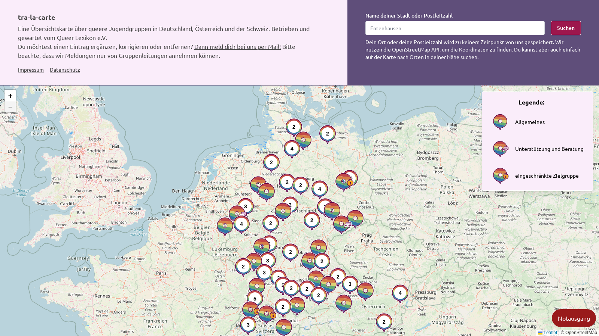

# Regenbogenkarte

Die Regenbogenkarte ist eine interaktive Karte für das Anzeigen und Entdecken von queeren (Jugend)-Gruppen.
Die Idee dahinter war, insbesondere Jugendlichen einen Anlaufpunkt zu geben, um sich mit Gleichgesinnten austauschen zu können.

<p align="center">
  
</p>

Der aktuelle Stand ist online vorzufinden: https://karte.queer-lexikon.net/

## Wo sind die Daten?

Wir haben uns bewusst dagegen entschieden, die dahinter liegenden Daten zu veröffentlichen.
Dennoch wollen wir den Code der Karte teilen, damit:

1. transparent wird, wie die Karte funktioniert.
2. Änderungen und Verbesserungen aus der Community ergänzt werden können.

Für Ergänzungen und Korrekturen einzelner Gruppen ist der E-Mail-Kontakt unter karte@queer-lexikon.net vorzuziehen. Bitte beachte, dass wir Meldungen nur von Gruppenleitungen annehmen können. 

## Wie funktioniert die Karte?

1. Beim Aufruf wird die Karte und eventuelle Elemente (Suchfeld, Menü, etc.) geladen. Für das
   Kartenmaterial nutzen wir den [deutschen OpenStreetMap-Server](https://openstreetmap.de/) des FOSSGIS e.V.
   Das Material steht unter einer CC-BY-SA 2.0 Lizenz.
2. Der aktuelle Ort wird abgefragt. Der Browser übermittelt uns die (ungefähren) Standortdaten.
   Zu diesen Koordinaten wird anschließend navigiert.

## Kompilieren

Die Karte ist rein JavaScript basiert. Wir nutzen aber für ein bisschen Komfort TypeScript, das macht
Refactorings deutlich leichter. Anschließend wird [Vite](https://vitejs.dev/) als Bundler genutzt und
die finalen, komprimierten Assets erzeugt. Verwaltet wird alles über `npm`. Also:

```shell
npm install     # installiert alle Abhängigkeiten
npm run build   # kompiliert den Code
```

### Code-Format

Prettier wird für ein einheitliches Format der Daten verwendet. Mit

```shell
npm run format
```

werden alle Dateien formatiert. Außerdem wird bei Pull Requests eingehender Code automatisch formatiert,
also falls es mal vergessen wurde, kein Problem.

### Warum nutzt ihr kein Framework wie Vue, React, Svelte, etc.?

Das hat mehrere Gründe. Zum Einen sind die benannten Frameworks stets im Wandel. Die Karte soll aber
eine fire-and-forget Lösung sein. Das heißt, einmal aufgesetzt und deployed, soll die erst mal bis in
alle Ewigkeiten laufen. Die stetigen Änderungen und der damit einhergehende Wartungsaufwand bei
den bekannten Frameworks ist nicht ohne. Natürlich achten diese darauf, dass die _breaking changes_
so klein wie möglich ausfallen, dennoch ist ein stetiges Weiterentwickeln der Karte notwendig.

Zum anderen ist die Funktionalität der Karte gering. Bis auf die Karte, ein Suchfeld und das mobile
Menü sind quasi keine interaktiven Elemente vorhanden. Es ist für Menschen, die nicht im JavaScript-
Universum unterwegs sind, deutlich einfacher, den sehr explizit geschriebenen Code der Karte zu verstehen,
anstatt erst einmal das benutzte Framework zu verstehen.

Sofern sich aber die Funktionalitäten der Karte in Zukunft erweitern, schließen wir nicht aus, Schritt
für Schritt die Karte auf eines der Frameworks umzubauen. Nur aktuell besteht kein Bedarf.

## Lizenzen

- Code: OSL-3.0
- Icons: CC-BY-ND 4.0
- Kartenmaterial: CC-BY-SA 2.0

## Dankeschön ❤️

Ein großes Dankeschön geht an all die lieben Vereine und Organisationen, die wir auf unserer Karte anzeigen dürfen.
Ein weiteres Dankeschön geht raus an den FOSSGIS e.V. für die Bereitstellung der Infrastruktur, auf dem die Karte aufbaut.
